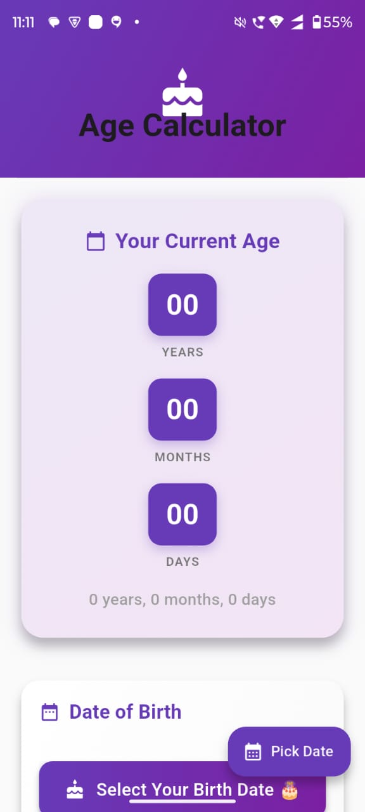
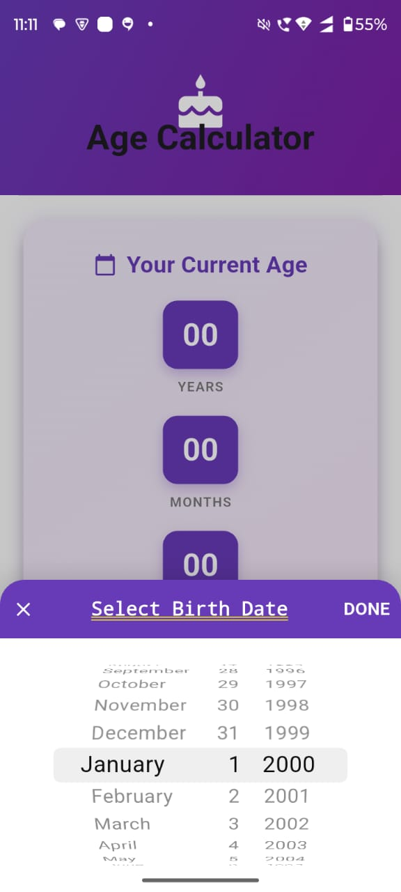
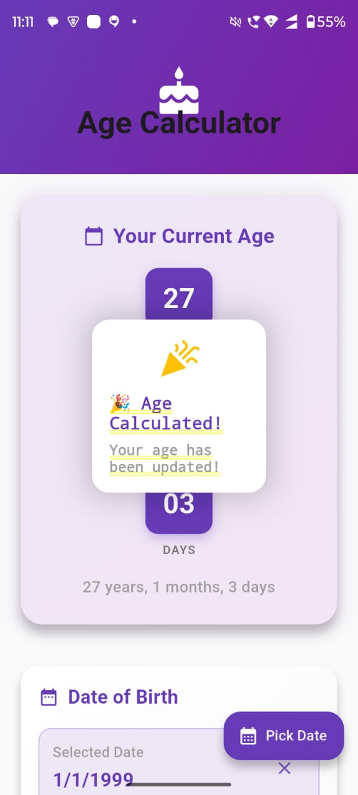

🎂 Age Calculator
A beautiful Flutter application that calculates your exact age with smooth animations and an elegant UI.

## 📸 Screenshots

  
  
  

✨ Features
Calculate exact age in years, months, and days

Smooth animations with elastic effects and transitions

Beautiful UI with gradient backgrounds and Material 3 design

Cupertino date picker for iOS-style date selection

Responsive design that works on all screen sizes

Celebration animation when age is calculated

Instant updates as you select dates

🚀 Getting Started
Copy the code into lib/main.dart

Run flutter pub get

Run flutter run

📱 How to Use
Tap "Select Your Birth Date 🎂"

Choose your birth date from the picker

Tap "DONE" to calculate

View your exact age with celebration animation

🎨 UI Highlights
Gradient app bar with bouncing title

Animated age cards with rotation and scale effects

Colorful celebration dialog

Responsive layout (horizontal/vertical based on screen)

Deep purple theme with amber accents

🔧 Built With
Flutter 3.0+

Material 3 design

Cupertino widgets

AnimationController for smooth animations

No external dependencies

📝 License
MIT License - free to use and modify

